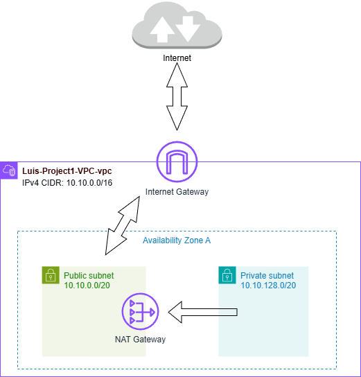

# Project 1 – AWS VPC with Public and Private Subnets

## Overview
This project demonstrates a production-style AWS Virtual Private Cloud (VPC) design 
featuring segmented public and private subnets, controlled internet access, and clearly 
defined traffic flow using native AWS networking components.

## Architecture Diagram

## AWS Services Used
- Amazon VPC
- Subnets (Public and Private)
- Route Tables
- Internet Gateway (IGW)
- NAT Gateway with Elastic IP

## Network Design
- Custom VPC with CIDR block: 10.10.0.0/16
- Public subnet with direct internet access via Internet Gateway
- Private subnet without direct internet access
- Outbound-only internet access for private subnet via NAT Gateway
- Separate route tables per subnet

## Traffic Flow
- Public subnet resources communicate directly with the internet through the Internet Gateway.
- Private subnet resources access the internet through the NAT Gateway for outbound traffic only.
- No inbound internet traffic is permitted directly to the private subnet.

## Security Considerations
- Network segmentation using public and private subnets
- Controlled egress for private resources
- Routing design following least-privilege principles

## Screenshots
1. VPC Overview  

2. Subnets  

3. Public Route Table  

4. Private Route Table  

5. NAT Gateway  

## Notes & Cost Management
This lab was built manually using the AWS Management Console to reinforce understanding of AWS networking fundamentals.  
After validation and documentation, cost-incurring resources (such as the NAT Gateway) were intentionally deleted to prevent unnecessary charges.

